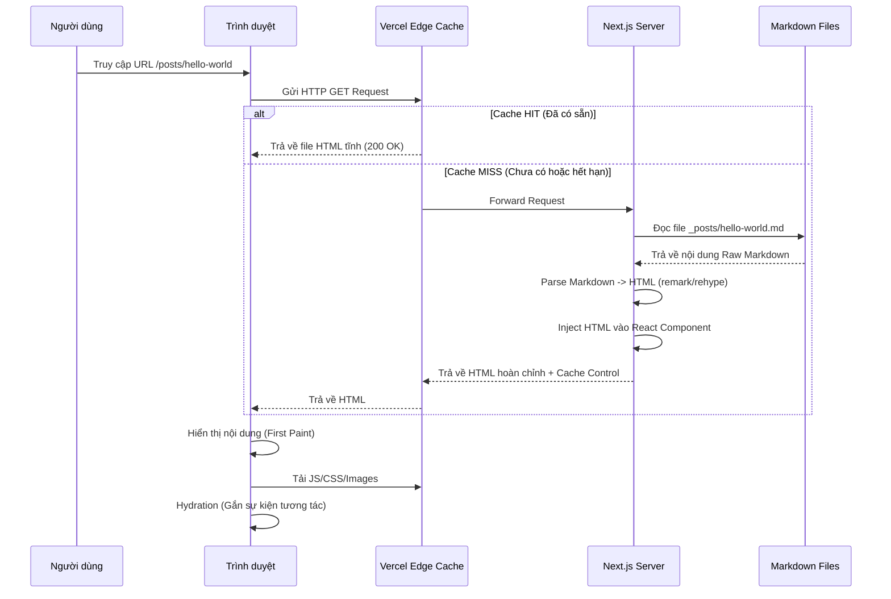
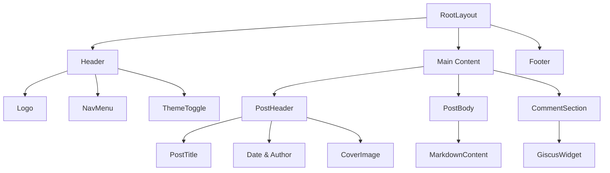

# BÁO CÁO ĐỒ ÁN MÔN HỌC
# LẬP TRÌNH MẠNG

---

**Đề tài:**
# XÂY DỰNG WEBSITE BLOG & PORTFOLIO CÁ NHÂN (DEVORBIT)
## Ứng dụng công nghệ Next.js, Server-Side Rendering (SSR) và Static Site Generation (SSG)

---

**Sinh viên thực hiện:** Hoàng Trọng Trà
**Mã sinh viên:** [Điền mã sinh viên của bạn]
**Lớp:** [Điền lớp của bạn]
**Giảng viên hướng dẫn:** [Điền tên GVHD]

---

**Hà Nội, Năm 2025**

\newpage

## LỜI CẢM ƠN

Để hoàn thành đồ án môn học "Lập Trình Mạng" này, đầu tiên, em xin gửi lời cảm ơn chân thành và sâu sắc nhất đến Ban Giám hiệu Nhà trường cùng các thầy cô giáo trong Khoa Công nghệ Thông tin đã tạo điều kiện thuận lợi cho chúng em học tập và nghiên cứu.

Đặc biệt, em xin gửi lời tri ân đến thầy/cô giảng viên bộ môn **Lập Trình Mạng**. Sự tận tình chỉ bảo, những bài giảng tâm huyết và những định hướng quý báu của thầy/cô trong suốt quá trình học tập không chỉ giúp em nắm vững kiến thức nền tảng về các giao thức mạng, mô hình Client-Server, mà còn là nguồn cảm hứng để em tìm tòi, ứng dụng các công nghệ mới vào thực tiễn. Những kiến thức này chính là kim chỉ nam giúp em vượt qua các thách thức kỹ thuật trong quá trình thực hiện đồ án "Xây dựng Website Blog & Portfolio cá nhân (DevOrbit)".

Em cũng xin gửi lời cảm ơn đến gia đình, bạn bè và các thành viên trong cộng đồng lập trình viên mã nguồn mở. Những lời động viên, chia sẻ tài liệu và những kinh nghiệm thực chiến từ cộng đồng đã giúp em giải quyết được nhiều vướng mắc trong quá trình phát triển sản phẩm.

Mặc dù đã nỗ lực hết mình và dành nhiều tâm huyết cho đồ án này, nhưng do giới hạn về thời gian cũng như kiến thức và kinh nghiệm thực tế còn hạn chế, đồ án chắc chắn không tránh khỏi những thiếu sót. Em rất mong nhận được những ý kiến đóng góp, nhận xét thẳng thắn từ quý thầy/cô và các bạn để có thể rút kinh nghiệm và hoàn thiện hơn trong những sản phẩm công nghệ tiếp theo.

Em xin chân thành cảm ơn!

**Sinh viên thực hiện**

*(Ký tên)*

**Hoàng Trọng Trà**

\newpage

## LỜI CAM ĐOAN

Em xin cam đoan đây là công trình nghiên cứu và thực hiện của riêng em, được phát triển dựa trên sự hướng dẫn của giảng viên và quá trình tự học hỏi, tìm tòi.

Các nội dung nghiên cứu, số liệu và kết quả trình bày trong đồ án này là trung thực và chưa từng được công bố trong bất kỳ công trình nghiên cứu nào khác tại trường hoặc các cơ sở đào tạo khác.

Các tài liệu tham khảo, cơ sở lý thuyết và mã nguồn mở (open source libraries) được sử dụng trong đồ án đều được trích dẫn nguồn gốc rõ ràng theo đúng quy định. Em tuyệt đối không sao chép nguyên văn đồ án của người khác.

Nếu phát hiện có bất kỳ sự gian lận nào, em xin chịu hoàn toàn trách nhiệm trước Hội đồng đánh giá, Nhà trường và pháp luật.

**Hà Nội, ngày ... tháng ... năm ...**
**Người cam đoan**

*(Ký tên)*

**Hoàng Trọng Trà**

\newpage

## MỤC LỤC

1.  [CHƯƠNG 1: TỔNG QUAN ĐỀ TÀI](#chương-1-tổng-quan-đề-tài)
    *   1.1. Lý do chọn đề tài
    *   1.2. Mục tiêu của đề tài
    *   1.3. Đối tượng và Phạm vi nghiên cứu
    *   1.4. Phương pháp nghiên cứu
    *   1.5. Cấu trúc báo cáo
2.  [CHƯƠNG 2: CƠ SỞ LÝ THUYẾT VÀ CÔNG NGHỆ](#chương-2-cơ-sở-lý-thuyết-và-công-nghệ)
    *   2.1. Tổng quan về Mạng máy tính và Ứng dụng Web
        *   2.1.1. Giao thức HTTP/HTTPS
        *   2.1.2. Mô hình Client-Server
        *   2.1.3. DNS và Quy trình hoạt động của Website
    *   2.2. Các kỹ thuật Rendering trong Web hiện đại
        *   2.2.1. Client-Side Rendering (CSR)
        *   2.2.2. Server-Side Rendering (SSR)
        *   2.2.3. Static Site Generation (SSG)
        *   2.2.4. So sánh và lý do lựa chọn Hybrid (Next.js)
    *   2.3. Hệ sinh thái React và Next.js
        *   2.3.1. React.js: Virtual DOM và Component-based
        *   2.3.2. Next.js Framework: App Router, Server Components
    *   2.4. Công nghệ Styling: Tailwind CSS
        *   2.4.1. Khái niệm Utility-first CSS
        *   2.4.2. Ưu điểm so với CSS truyền thống
    *   2.5. Quản lý nội dung với Markdown và Frontmatter
3.  [CHƯƠNG 3: PHÂN TÍCH VÀ THIẾT KẾ HỆ THỐNG](#chương-3-phân-tích-và-thiết-kế-hệ-thống)
    *   3.1. Đặc tả yêu cầu kỹ thuật
        *   3.1.1. Yêu cầu chức năng (Functional Requirements)
        *   3.1.2. Yêu cầu phi chức năng (Non-functional Requirements)
    *   3.2. Biểu đồ Use Case
    *   3.3. Thiết kế kiến trúc hệ thống
    *   3.4. Thiết kế Cơ sở dữ liệu (Cấu trúc File System)
    *   3.5. Thiết kế Giao diện (UI/UX)
        *   3.5.1. Hệ thống màu sắc (Color Palette)
        *   3.5.2. Typography
        *   3.5.3. Layout
4.  [CHƯƠNG 4: XÂY DỰNG VÀ TRIỂN KHAI](#chương-4-xây-dựng-và-triển-khai)
    *   4.1. Môi trường phát triển và Cài đặt
    *   4.2. Cấu trúc mã nguồn chi tiết
    *   4.3. Cài đặt các chức năng chính (Kèm Code minh họa)
        *   4.3.1. Xử lý Markdown (File `lib/api.ts`)
        *   4.3.2. Tạo Sitemap và RSS Feed tự động (Script `generate-static-files.mjs`)
        *   4.3.3. Cấu hình Next.js (`next.config.ts`)
    *   4.4. Triển khai (Deployment) lên Vercel
5.  [CHƯƠNG 5: KIỂM THỬ VÀ ĐÁNH GIÁ](#chương-5-kiểm-thử-và-đánh-giá)
    *   5.1. Các kịch bản kiểm thử (Test Cases)
    *   5.2. Đánh giá hiệu năng (Lighthouse Score)
    *   5.3. Kết quả đạt được (Hình ảnh demo)
6.  [CHƯƠNG 6: KẾT LUẬN](#chương-6-kết-luận)
    *   6.1. Tổng kết
    *   6.2. Hạn chế
    *   6.3. Hướng phát triển trong tương lai
7.  [CHƯƠNG 7: CÁC KẾT QUẢ VÀ CHỨNG CHỈ ĐẠT ĐƯỢC](#chương-7-các-kết-quả-và-chứng-chỉ-đạt-được)
8.  [TÀI LIỆU THAM KHẢO](#tài-liệu-tham-khảo)

\newpage

## DANH MỤC CÁC TỪ VIẾT TẮT

| Từ viết tắt | Tiếng Anh | Tiếng Việt |
| :--- | :--- | :--- |
| **API** | Application Programming Interface | Giao diện lập trình ứng dụng |
| **CDN** | Content Delivery Network | Mạng phân phối nội dung |
| **CMS** | Content Management System | Hệ thống quản lý nội dung |
| **CSR** | Client-Side Rendering | Kỹ thuật render phía trình duyệt (Client) |
| **CSS** | Cascading Style Sheets | Ngôn ngữ định dạng văn bản |
| **DNS** | Domain Name System | Hệ thống tên miền |
| **DOM** | Document Object Model | Mô hình đối tượng tài liệu |
| **HTML** | HyperText Markup Language | Ngôn ngữ đánh dấu siêu văn bản |
| **HTTP** | HyperText Transfer Protocol | Giao thức truyền tải siêu văn bản |
| **HTTPS** | HyperText Transfer Protocol Secure | Giao thức truyền tải siêu văn bản bảo mật |
| **JS** | JavaScript | Ngôn ngữ lập trình JavaScript |
| **JSON** | JavaScript Object Notation | Định dạng dữ liệu dạng đối tượng JavaScript |
| **PWA** | Progressive Web App | Ứng dụng Web tiến bộ |
| **SEO** | Search Engine Optimization | Tối ưu hóa công cụ tìm kiếm |
| **SSG** | Static Site Generation | Kỹ thuật tạo trang tĩnh |
| **SSR** | Server-Side Rendering | Kỹ thuật render phía máy chủ |
| **UI** | User Interface | Giao diện người dùng |
| **URL** | Uniform Resource Locator | Định vị tài nguyên thống nhất |
| **UX** | User Experience | Trải nghiệm người dùng |

\newpage

## CHƯƠNG 1: TỔNG QUAN ĐỀ TÀI

### 1.1. Lý do chọn đề tài

Trong bối cảnh cuộc Cách mạng Công nghiệp 4.0 đang diễn ra mạnh mẽ, Internet đã trở thành một phần không thể thiếu trong đời sống xã hội và đặc biệt là trong lĩnh vực Công nghệ thông tin. Đối với một lập trình viên (Developer), việc sở hữu một "định danh số" trên không gian mạng là vô cùng quan trọng.

Một Website cá nhân tích hợp Blog và Portfolio không chỉ đơn thuần là nơi lưu trữ các dự án đã thực hiện, mà còn là:
1.  **Nơi chia sẻ kiến thức:** Viết blog kỹ thuật giúp củng cố kiến thức đã học ("Learning by Teaching") và đóng góp giá trị cho cộng đồng.
2.  **Hồ sơ năng lực sống động:** Thay vì một bản CV (Curriculum Vitae) tẻ nhạt trên giấy, một website với giao diện tương tác, hiệu ứng mượt mà sẽ gây ấn tượng mạnh mẽ hơn với nhà tuyển dụng.
3.  **Sân chơi thực nghiệm:** Là môi trường lý tưởng (Sandbox) để thử nghiệm các công nghệ mới (như Next.js App Router, Tailwind Animations) mà không chịu áp lực của các dự án thương mại.

Môn học **Lập Trình Mạng** cung cấp những kiến thức nền tảng quan trọng về cách thức Internet vận hành, từ các giao thức tầng thấp đến các tầng ứng dụng cao hơn như HTTP/HTTPS. Để hiện thực hóa những lý thuyết khô khan đó thành một sản phẩm thực tế, em đã quyết định lựa chọn đề tài **"Xây dựng Website Blog & Portfolio cá nhân (DevOrbit)"**.

Đồ án này là cơ hội để em đi sâu nghiên cứu về các kỹ thuật render hiện đại (SSR/SSG), tối ưu hóa SEO (Search Engine Optimization) và nắm vững quy trình CI/CD (Continuous Integration/Continuous Deployment) khi làm việc với GitHub và Vercel.

### 1.2. Mục tiêu của đề tài

Đề tài đặt ra các mục tiêu cụ thể, chia thành hai nhóm chính:

**Mục tiêu học thuật:**
*   Hiểu rõ cơ chế hoạt động của mô hình Client-Server trong môi trường Web.
*   Phân biệt được sự khác nhau và ưu nhược điểm của CSR, SSR và SSG.
*   Nắm vững cách cấu hình và tối ưu hóa một Web Server (thông qua Next.js config và Vercel Edge Network).
*   Hiểu về quy trình phân giải tên miền (DNS) và bảo mật HTTPS.

**Mục tiêu sản phẩm:**
*   Xây dựng thành công website **DevOrbit** hoạt động ổn định, tốc độ tải trang dưới 1s.
*   Giao diện người dùng (UI) đẹp mắt, hiện đại, mang đậm dấu ấn cá nhân.
*   Trải nghiệm người dùng (UX) mượt mà trên mọi thiết bị (Responsive Design).
*   Hệ thống quản lý bài viết (CMS) đơn giản dựa trên Git và Markdown, không phụ thuộc vào Database phức tạp để tiết kiệm chi phí vận hành.
*   Đạt điểm số cao (90-100) trên công cụ đo lường Google Lighthouse về Performance, Accessibility, Best Practices và SEO.

### 1.3. Đối tượng và Phạm vi nghiên cứu

**Đối tượng nghiên cứu:**
*   Framework Next.js (Phiên bản mới nhất ~14/15) và React.js.
*   Ngôn ngữ lập trình TypeScript (Tăng tính chặt chẽ cho code).
*   Framework CSS: Tailwind CSS.
*   Giao thức mạng: HTTP/1.1, HTTP/2.
*   Cấu trúc dữ liệu Markdown và thư viện xử lý nội dung (Unified ecosystem: remark, rehype).

**Phạm vi đề tài:**
*   Xây dựng ứng dụng Web quy mô nhỏ/trung bình (Personal Website).
*   Không tập trung vào xây dựng Backend phức tạp (như Authentication, Database SQL) mà tập trung tối ưu hóa Frontend và Performance phía Client/Edge.
*   Tích hợp các dịch vụ bên thứ 3: Giscus (Comment), Vercel Analytics.

### 1.4. Phương pháp nghiên cứu

*   **Phương pháp tham khảo tài liệu:** Đọc hiểu tài liệu chính thức (Documentation) của Next.js, React, Tailwind CSS. Tham khảo các mã nguồn mở trên GitHub để học hỏi cách tổ chức code (Architectural Patterns).
*   **Phương pháp thực nghiệm:** Vừa học vừa làm (Learning by Doing). Chia nhỏ dự án thành các module (Header, Footer, Blog Engine...) và code từng phần, kiểm thử ngay lập tức.
*   **Phương pháp so sánh:** So sánh hiệu năng giữa các cách implement khác nhau (ví dụ: dùng thẻ `` thường vs `next/image`) để chọn ra giải pháp tối ưu.

### 1.5. Cấu trúc báo cáo

Báo cáo được chia thành 6 chương chính:
*   **Chương 1:** Giới thiệu tổng quan về đề tài, lý do và mục tiêu.
*   **Chương 2:** Trình bày chi tiết cơ sở lý thuyết về mạng máy tính và các công nghệ Web hiện đại được sử dụng.
*   **Chương 3:** Phân tích yêu cầu và thiết kế hệ thống (Architecture, UI/UX, Data).
*   **Chương 4:** Đi sâu vào quá trình cài đặt, cấu trúc code và các giải pháp kỹ thuật cụ thể.
*   **Chương 5:** Kiểm thử, đánh giá hiệu năng và minh họa kết quả.
*   **Chương 6:** Kết luận và định hướng phát triển.

\newpage

## CHƯƠNG 2: CƠ SỞ LÝ THUYẾT VÀ CÔNG NGHỆ

### 2.1. Tổng quan về Mạng máy tính và Ứng dụng Web

#### 2.1.1. Giao thức HTTP/HTTPS
HTTP (Hypertext Transfer Protocol) là giao thức nền tảng của World Wide Web, hoạt động ở tầng ứng dụng (Application Layer) của mô hình OSI. HTTP định nghĩa cách thức các thông điệp (messages) được định dạng và truyền tải, cũng như các hành động mà Web Server và Web Browser phải thực hiện để đáp ứng các lệnh.

Trong đồ án này, việc hiểu HTTP là cực kỳ quan trọng để tối ưu hóa việc tải tài nguyên:
*   **HTTP Methods:** GET (lấy dữ liệu), POST (gửi dữ liệu), PUT/PATCH (cập nhật), DELETE (xóa). Website DevOrbit chủ yếu sử dụng phương thức **GET** để tải các file HTML, CSS, JS và hình ảnh.
*   **Status Codes:**
    *   `200 OK`: Thành công.
    *   `304 Not Modified`: Tài nguyên chưa thay đổi, dùng cache (Rất quan trọng cho tốc độ).
    *   `404 Not Found`: Không tìm thấy trang (Cần thiết kế trang 404 Custom).
    *   `500 Internal Server Error`: Lỗi server.

**HTTPS (HTTP Secure):** Là phiên bản bảo mật của HTTP, sử dụng SSL/TLS để mã hóa dữ liệu truyền tải giữa Client và Server. Trong dự án này, Vercel tự động cung cấp chứng chỉ SSL miễn phí, đảm bảo tính bảo mật và tăng uy tín cho website (icon ổ khóa trên trình duyệt).

#### 2.1.2. Mô hình Client-Server
Mô hình Khách-Chủ (Client-Server) là kiến trúc mạng cơ bản:
*   **Client (Phía khách):** Là trình duyệt web (Chrome, Firefox...) hoặc thiết bị di động của người dùng. Client gửi yêu cầu (Request) đến Server.
*   **Server (Phía chủ):** Là máy chủ lưu trữ mã nguồn website, cơ sở dữ liệu. Server nhận yêu cầu, xử lý (ví dụ: đọc file markdown, query database) và gửi lại phản hồi (Response) cho Client.

Trong dự án DevOrbit:
*   **Client:** Browser của người dùng, thực thi JavaScript, render giao diện.
*   **Server:** Vercel đóng vai trò là Server (Serverless Functions) và CDN (Content Delivery Network) để phân phối nội dung tĩnh.

#### 2.1.3. DNS và Quy trình hoạt động của Website
Khi người dùng gõ `devorbit.vercel.app` vào trình duyệt:
1.  Trình duyệt kiểm tra Cache DNS.
2.  Nếu không có, nó gửi yêu cầu đến DNS Server để phân giải tên miền thành địa chỉ IP.
3.  Trình duyệt thiết lập kết nối TCP với Server tại IP đó (bắt tay 3 bước).
4.  Nếu dùng HTTPS, thực hiện thêm quá trình bắt tay SSL/TLS.
5.  Trình duyệt gửi HTTP Request (GET /).
6.  Server xử lý và trả về HTML.
7.  Trình duyệt phân tích (Parse) HTML và tiếp tục gửi request để tải CSS, JS, Image.
8.  Trình duyệt render giao diện hoàn chỉnh.

### 2.2. Phân tích các mô hình Rendering trong Ứng dụng Web hiện đại

Trong sự phát triển của công nghệ Web, kỹ thuật Rendering (kết xuất) đóng vai trò quyết định đến hiệu năng (Performance), khả năng tối ưu hóa công cụ tìm kiếm (SEO) và trải nghiệm người dùng (UX). Phần này sẽ phân tích chi tiết ba mô hình chính: Client-Side Rendering (CSR), Server-Side Rendering (SSR) và Static Site Generation (SSG), từ đó biện giải lý do lựa chọn giải pháp Hybrid trên nền tảng Next.js cho dự án DevOrbit.

#### 2.2.1. Client-Side Rendering (CSR)
*   **Cơ chế hoạt động:** Trong mô hình CSR, Web Server ban đầu chỉ gửi về một tài liệu HTML sơ khai (thường chỉ chứa một thẻ container rỗng) cùng với các tài nguyên JavaScript (Bundle). Trình duyệt (Client) sau khi tải Bundle sẽ thực thi mã JavaScript để khởi tạo, tính toán và "vẽ" (render) giao diện người dùng (UI) trực tiếp lên DOM.
*   **Phân tích kỹ thuật:**
    *   *Single Page Application (SPA):* CSR là nền tảng của các ứng dụng SPA, nơi việc chuyển trang không yêu cầu tải lại toàn bộ tài liệu (Full Page Reload) mà chỉ cập nhật lại DOM, mang lại trải nghiệm mượt mà.
    *   *Nhược điểm về SEO và FCP:* Do nội dung thực sự chỉ xuất hiện sau khi JavaScript thực thi, các Bot tìm kiếm (Crawlers) thế hệ cũ có thể gặp khó khăn trong việc đánh chỉ mục (index). Thời gian hiển thị nội dung đầu tiên (First Contentful Paint - FCP) thường chậm do phụ thuộc vào tải trọng và tốc độ xử lý JS của thiết bị người dùng.

#### 2.2.2. Server-Side Rendering (SSR)
*   **Cơ chế hoạt động:** Với SSR, mọi yêu cầu (Request) từ Client đều được Server xử lý. Server thực thi logic ứng dụng, truy vấn dữ liệu và tạo ra một tài liệu HTML hoàn chỉnh chứa đầy đủ nội dung trước khi gửi trả về Client.
*   **Phân tích kỹ thuật:**
    *   *Tối ưu SEO:* HTML trả về đã chứa nội dung ngữ nghĩa (Semantic Content), giúp các công cụ tìm kiếm dễ dàng phân tích và xếp hạng.
    *   *Cải thiện FCP:* Người dùng nhìn thấy nội dung ngay lập tức mà không cần đợi JavaScript tải xong; tuy nhiên, trang web chỉ thực sự tương tác được sau khi quá trình Hydration hoàn tất.
    *   *Thách thức về TTFB:* Thời gian phản hồi byte đầu tiên (Time to First Byte - TTFB) có thể lâu hơn vì Server phải tốn thời gian xử lý (Processing Time) cho mỗi Request.

#### 2.2.3. Static Site Generation (SSG)
*   **Cơ chế hoạt động:** SSG thực hiện quá trình render toàn bộ ứng dụng thành các tệp HTML tĩnh ngay tại thời điểm xây dựng (Build Time). Các tệp này sau đó được lưu trữ và phân phối qua mạng lưới phân phối nội dung (CDN).
*   **Phân tích ưu điểm vượt trội:**
    *   *Hiệu năng cực đại:* Loại bỏ hoàn toàn thời gian tính toán của Server tại thời điểm Request. Thời gian phản hồi chỉ phụ thuộc vào độ trễ mạng (Network Latency).
    *   *Bảo mật và Chi phí:* Giảm thiểu bề mặt tấn công do không kết nối cơ sở dữ liệu trực tiếp tại Runtime. Chi phí vận hành thấp do chỉ phục vụ file tĩnh.
*   **Phù hợp:** Lý tưởng cho các website ít thay đổi nội dung theo thời gian thực như Blog, Portfolio, Documentation.

#### 2.2.4. Lý do lựa chọn Kiến trúc Hybrid với Next.js
Dự án DevOrbit lựa chọn **Next.js** bởi khả năng hỗ trợ mô hình Hybrid Rendering linh hoạt:
*   **Áp dụng SSG:** Cho các trang bài viết (Blog Posts) và trang chủ để đảm bảo tốc độ truy cập nhanh nhất (Fastest Time-to-Interactive).
*   **Áp dụng ISR (Incremental Static Regeneration):** Cho phép cập nhật nội dung tĩnh định kỳ mà không cần Build lại toàn bộ dự án.
*   **Client-Side Hydration:** Sử dụng React để chuyển đổi các trang tĩnh thành ứng dụng tương tác mượt mà sau khi tải xong.

### 2.3. Hệ sinh thái công nghệ: React.js và Next.js

#### 2.3.1. React.js và Cơ chế Virtual DOM
React.js là thư viện JavaScript xây dựng giao diện người dùng dựa trên thành phần (Component-based Architecture).
*   **Virtual DOM (DOM Ảo):** React duy trì một bản sao nhẹ của DOM thực trong bộ nhớ. Khi trạng thái (State) ứng dụng thay đổi, thuật toán **Reconciliation** sẽ so sánh sự khác biệt (Diffing) giữa Virtual DOM mới và cũ, từ đó tính toán số lượng thao tác tối thiểu cần thực hiện trên DOM thực. Cơ chế này giúp tối ưu hóa hiệu suất render, giảm thiểu chi phí tính toán khi cập nhật giao diện.
*   **Declarative Programming:** React khuyến khích phong cách lập trình khai báo, mô tả UI dựa trên trạng thái hiện tại, giúp mã nguồn dễ đọc và dễ dự đoán hơn.

#### 2.3.2. Next.js Framework và App Router
Next.js mở rộng khả năng của React với kiến trúc hiện đại để sẵn sàng cho Production:
*   **App Router & Server Components:** Phiên bản Next.js mới sử dụng kiến trúc App Router, mặc định sử dụng React Server Components (RSC). Điều này cho phép logic rẽ nhánh (Routing) và truy xuất dữ liệu (Data Fetching) diễn ra hoàn toàn trên Server, giảm đáng kể dung lượng JavaScript gửi xuống Client (Zero Bundle Size for Server Logic).
*   **File-system Based Routing:** Cấu trúc thư mục định nghĩa trực tiếp các tuyến đường (URL Routing), giúp việc tổ chức dự án khoa học và trực quan.

### 2.4. Đánh giá lựa chọn Tailwind CSS
Thay vì các mô hình truyền thống (BEM, OOCSS) hay CSS-in-JS, dự án sử dụng **Utility-First CSS** với Tailwind CSS.
*   **Phân tích hiệu quả:**
    *   *Tối ưu Bundle Size:* Thông qua quá trình PurgeCSS tại Build time, Tailwind tự động loại bỏ các class không sử dụng, giúp file CSS cuối cùng cực kỳ nhẹ (< 10KB Gzipped).
    *   *Tính nhất quán (Consistency):* Sử dụng hệ thống Design Tokens định sẵn (Color palette, Spacing scale, Typography) giúp giao diện đồng bộ, tránh các giá trị ngẫu nhiên ("Magic Numbers") gây khó khăn trong bảo trì.
    *   *Responsive Design:* Hỗ trợ xây dựng giao diện đa thiết bị dễ dàng thông qua các tiền tố media query (ví dụ: `md:`, `lg:`).

### 2.5. Quản lý nội dung (CMS) theo kiến trúc Git-based
Dự án áp dụng mô hình **Headless CMS** đơn giản hóa, sử dụng Git làm nơi lưu trữ dữ liệu (Single Source of Truth).
*   **Markdown/MDX:** Nội dung bài viết được lưu trữ dưới dạng Markdown với phần Frontmatter (metadata YAML). Đây là định dạng lưu trữ phi cấu trúc, nhẹ, dễ dàng kiểm soát phiên bản (Version Control) và di chuyển (Portable).
*   **Unified Ecosystem:** Sử dụng chuỗi công cụ xử lý Abstract Syntax Tree (AST) gồm `remark` (parse Markdown) và `rehype` (compile sang HTML) để chuyển đổi nội dung, cho phép can thiệp sâu vào quá trình render (ví dụ: tự động thêm ID cho thẻ Heading, Syntax Highlighting cho khối lệnh).

\newpage

## CHƯƠNG 3: PHÂN TÍCH VÀ THIẾT KẾ HỆ THỐNG

### 3.1. Đặc tả yêu cầu kỹ thuật

#### 3.1.1. Yêu cầu chức năng
Hệ thống phải đáp ứng các chức năng sau:
1.  **Chức năng Xem bài viết (Blog Reader):**
    *   Hiển thị danh sách bài viết phân trang hoặc tải thêm.
    *   Lọc bài viết theo thẻ (Tags).
    *   Xem chi tiết bài viết với định dạng đẹp (Heading, List, Image, Code block highlighting).
    *   Hiển thị mục lục (Table of Contents) tự động cho mỗi bài.
2.  **Chức năng Giới thiệu (Portfolio):**
    *   Trang About: Giới thiệu bản thân, học vấn.
    *   Trang Projects: Show các dự án cá nhân kèm link GitHub/Demo.
    *   Trang Certificates: Show bằng cấp dưới dạng lưới hoặc timeline.
3.  **Chức năng Tương tác:**
    *   Bình luận (sử dụng Giscus - GitHub Discussions).
    *   Chia sẻ bài viết lên mạng xã hội.
4.  **Chức năng Hệ thống:**
    *   Chuyển đổi giao diện Sáng/Tối (Dark/Light mode) - Lưu preference vào LocalStorage.
    *   RSS Feed cho các trình đọc tin.
    *   Sitemap cho Google Bot.

#### 3.1.2. Yêu cầu phi chức năng
1.  **Hiệu năng:** Điểm Lighthouse > 90. Core Web Vitals (LCP, CLS, FID) đạt chuẩn Google (xanh lá).
2.  **Khả năng bảo trì:** Code phải được tổ chức theo module, có Type (TypeScript) đầy đủ.
3.  **SEO:** Tất cả các trang đều phải có thẻ Meta Title, Meta Description, và Open Graph (hình ảnh khi share Facebook).
4.  **Khả năng tiếp cận (Accessibility):** Đạt chuẩn WCAG cơ bản (độ tương phản màu sắc, hỗ trợ điều hướng bằng bàn phím).

### 3.2. Biểu đồ Use Case

```mermaid
useCaseDiagram
    actor "Người đọc (Guest)" as Guest
    actor "Tác giả (Admin)" as Admin

    package "Hệ thống Blog DevOrbit" {
        usecase "Xem danh sách bài viết" as UC1
        usecase "Đọc chi tiết bài viết" as UC2
        usecase "Tìm kiếm/Lọc bài viết" as UC3
        usecase "Xem thông tin tác giả (About)" as UC4
        usecase "Bình luận (Giscus)" as UC5
        usecase "Viết bài mới (Markdown)" as UC6
        usecase "Cập nhật Portfolio" as UC7
        usecase "Triển khai (Deployment)" as UC8
    }

    Guest --> UC1
    Guest --> UC2
    Guest --> UC3
    Guest --> UC4
    Guest --> UC5

    Admin --> UC6
    Admin --> UC7
    Admin --> UC8
    Admin --> UC5
```

### 3.3. Thiết kế kiến trúc hệ thống

Hệ thống được thiết kế theo mô hình **Monolithic** nhưng tổ chức source code theo hướng **Modular**.

```mermaid
graph TD
    User[Người dùng (Browser)] -->|HTTP GET /| CDN[Vercel Edge Network (CDN)]
    
    subgraph "Vercel Cloud Platform"
        CDN -->|Cache Hit| Static[Static Content (HTML/CSS/IMG)]
        CDN -->|Cache Miss| NextServer[Next.js Server (SSR/ISR)]
        
        NextServer -->|Build Page| ReactComp[React Server Components]
        ReactComp -->|Read Content| Markdown System
    end
    
    subgraph "Data Layer (File System)"
        Markdown[_posts/*.md]
        Assets[public/*]
    end

    ReactComp -.->|fs.readFile| Markdown
    
    subgraph "Third Party Services"
        Giscus[Giscus (Comments)]
    end

    User -->|Client-side Interaction| Giscus
```

**Tầng Client (Browser):**
*   Nhận HTML/CSS tĩnh từ CDN.
*   Hydrate JavaScript để trở thành ứng dụng tương tác (Interactive).
*   Gửi request đến Serverless API (nếu có tính năng search/form).

**Tầng Cấu trúc thư mục (Folder Structure):**
```
dev-orbit-blog/
├── _posts/                 # Database dạng file (Markdown)
│   ├── bai-viet-1.md
│   └── bai-viet-2.md
├── public/                 # Assets tĩnh (Images, Videos)
├── src/
│   ├── app/                # Next.js App Router
│   │   ├── layout.tsx      # Layout chính (Header, Footer)
│   │   ├── page.tsx        # Trang chủ
│   │   ├── posts/[slug]/   # Trang chi tiết bài viết (Dynamic Route)
│   │   └── ...
│   ├── lib/                # Business Logic (Code xử lý file)
│   │   ├── api.ts          # Hàm đọc file, filter post
│   │   └── constants.ts    # Hằng số
│   ├── components/         # UI Components
│   │   ├── Header.tsx
│   │   ├── Footer.tsx
│   │   ├── PostCard.tsx
│   │   └── ...
│   └── styles/             # Global CSS
└── ...cấu hình...
```

### 3.4. Thiết kế Giao diện (UI/UX)

#### 3.4.1. Hệ thống màu sắc
Dự án sử dụng tông màu chủ đạo là **Slate** (Xám xanh) tạo cảm giác hiện đại, công nghệ (Tech-savvy).
*   **Light Mode:** Nền trắng (#ffffff), chữ đen xám (#1e293b).
*   **Dark Mode:** Nền tối (#0f172a / Slate-900), chữ trắng xám (#e2e8f0).
*   **Accent Color (Màu nhấn):** Sử dụng Gradient tím-xanh (Indigo-Cyan) cho các nút bấm, link để tạo điểm nhấn thị giác.

#### 3.4.2. Typography
Sử dụng Font chữ **Inter** (Google Fonts). Đây là font chữ sans-serif được thiết kế chuyên biệt cho màn hình máy tính, có độ dễ đọc (readability) rất cao ở các kích thước nhỏ. #### 3.4.3. Bố cục (Layout) và Responsive Design
Giao diện được thiết kế theo nguyên tắc "Mobile First" với Grid System 12 cột.

```mermaid
graph TD
    subgraph "Layout Structure"
        A[Header / Navbar]
        B[Main Content Area]
        C[Sidebar (Desktop Only)]
        D[Footer]
    end
    
    A --> B
    B --> D
    
    style A fill:#f9f,stroke:#333
    style B fill:#bbf,stroke:#333
    style C fill:#bfb,stroke:#333
    style D fill:#f9f,stroke:#333
```

*   **Header:** Sticky at top, chứa Logo, Navigation Menu, Theme Toggle.
*   **Main Content:** Chứa nội dung chính (Bài viết, Danh sách).
*   **Footer:** Thông tin bản quyền, Social Links.

### 3.5. Thiết kế Cấu trúc Dữ liệu (Schema)
Vì không sử dụng Database quan hệ (RDBMS), cấu trúc dữ liệu được định nghĩa thông qua các Interfaces TypeScript và Frontmatter của Markdown.

#### 3.5.1. Post Interface (Bài viết)
```typescript
interface Post {
  slug: string;        // Định danh bài viết (URL)
  title: string;       // Tiêu đề
  date: string;        // Ngày xuất bản (ISO 8601)
  coverImage: string;  // Đường dẫn ảnh bìa
  author: Author;      // Thông tin tác giả
  excerpt: string;     // Đoạn trích dẫn ngắn
  ogImage: {
    url: string;       // Ảnh hiển thị khi chia sẻ MXH
  };
  content: string;     // Nội dung HTML (sau khi parse)
  tags: string[];      // Danh sách thẻ phân loại
}
```

#### 3.5.2. Author Interface
```typescript
interface Author {
  name: string;        // Tên tác giả
  picture: string;     // Avatar
}
```

### 3.6. Biểu đồ Tuần tự (Sequence Diagram)
Mô tả quy trình xử lý khi người dùng truy cập vào một bài viết cụ thể.



### 3.7. Thiết kế Component (React Component Hierarchy)
Ứng dụng được chia nhỏ thành các Component tái sử dụng theo cấu trúc cây (Tree Structure).



\newpage

## CHƯƠNG 4: XÂY DỰNG VÀ TRIỂN KHAI

Để hiện thực hóa các thiết kế đã đề ra, quá trình xây dựng được tiến hành theo quy trình phát triển phần mềm chuẩn (SDLC), từ việc thiết lập môi trường, tổ chức mã nguồn đến phát triển từng module chức năng và cuối cùng là triển khai kiểm thử.

### 4.1. Chuẩn bị môi trường phát triển (Development Setup)

Trước khi bắt đầu dự án, môi trường lập trình cần được thiết lập đồng bộ để đảm bảo tính nhất quán giữa các thành viên và tương thích với CI/CD pipeline sau này.

1.  **Node.js Runtime:** Cài đặt phiên bản Node.js LTS (v18.17.0 hoặc v20.x). Đây là nền tảng runtime bắt buộc để chạy Next.js.
2.  **Package Manager (npm/yarn/pnpm):** Sử dụng `npm` (Node Package Manager) để quản lý hơn 20 thư viện dependencies.
3.  **IDE (Visual Studio Code):**
    *   *ESLint Plugin:* Phát hiện lỗi logic và style code.
    *   *Prettier Plugin:* Tự động định dạng code cho đẹp và thống nhất.
    *   *Tailwind CSS IntelliSense:* Gợi ý class name cho CSS.

### 4.2. Tổ chức Mã nguồn (Project Structure Detailed)

Cấu trúc thư mục của **DevOrbit** tuân thủ theo Convention của Next.js 14 App Router, tách biệt rõ ràng giữa logic, giao diện và dữ liệu.

```bash
dev-orbit/
├── _posts/                 # [MODEL] Cơ sở dữ liệu Markdown
│   ├── hello-world.md      # Bài viết mẫu
│   └── nextjs-tutorial.md
├── public/                 # [ASSETS] Tài nguyên tĩnh
│   ├── images/
│   └── favicon.ico
├── src/
│   ├── app/                # [VIEW + CONTROLLER] App Router
│   │   ├── _components/    # Các UI Components nhỏ (Button, Card)
│   │   ├── posts/          # Route: /posts
│   │   │   └── [slug]/     # Dynamic Route: /posts/:slug
│   │   │       └── page.tsx # Controller hiển thị chi tiết bài viết
│   │   ├── layout.tsx      # Main Layout (Header + Footer)
│   │   ├── page.tsx        # Controller trang chủ
│   │   └── globals.css     # CSS toàn cục (Tailwind directives)
│   ├── lib/                # [SERVICE] Logic xử lý nghiệp vụ
│   │   ├── api.ts          # Service đọc/ghi file Markdown
│   │   ├── markdownToHtml.ts # Service convert Markdown
│   │   └── constants.ts    # Hằng số cấu hình (Site Name, URL)
│   └── interfaces/         # [TYPES] Định nghĩa Type/Interface
│       └── post.ts         # Post Interface
├── next.config.mjs         # Cấu hình Next.js (Security, Image Domains)
├── package.json            # Danh sách thư viện
└── tailwind.config.ts      # Cấu hình Design System
```

### 4.3. Hiện thực hóa các Module chức năng (Implementation)

#### 4.3.1. Module Xử lý Dữ liệu Markdown (The Core Engine)
Đây là "trái tim" của Blog, chịu trách nhiệm đọc dữ liệu từ file hệ thống, parse metadata và nội dung.

*File: `src/lib/api.ts`*
```typescript
import fs from "fs";
import { join } from "path";
import matter from "gray-matter";

const postsDirectory = join(process.cwd(), "_posts");

export function getPostSlugs() {
  return fs.readdirSync(postsDirectory);
}

export function getPostBySlug(slug: string) {
  const realSlug = slug.replace(/\.md$/, "");
  const fullPath = join(postsDirectory, `${realSlug}.md`);
  const fileContents = fs.readFileSync(fullPath, "utf8");
  
  // Sử dụng thư viện gray-matter để tách frontmatter và content
  const { data, content } = matter(fileContents);

  return { ...data, slug: realSlug, content } as Post;
}

export function getAllPosts() {
  const slugs = getPostSlugs();
  const posts = slugs
    .map((slug) => getPostBySlug(slug))
    // Sắp xếp bài viết mới nhất lên đầu (descending date)
    .sort((post1, post2) => (post1.date > post2.date ? -1 : 1));
  return posts;
}
```

*File: `src/lib/markdownToHtml.ts`*
Sử dụng pipeline của hệ sinh thái Unified để chuyển đổi Markdown sang HTML an toàn:
```typescript
import { remark } from "remark";
import html from "remark-html";

export default async function markdownToHtml(markdown: string) {
  const result = await remark().use(html).process(markdown);
  return result.toString();
}
```

#### 4.3.2. Module Giao diện & Styling (Tailwind Config)
Cấu hình Design System trực tiếp trong `tailwind.config.ts` để đảm bảo sự đồng bộ về màu sắc và spacing.

```typescript
import type { Config } from "tailwindcss";

const config: Config = {
  content: ["./src/**/*.{js,ts,jsx,tsx,mdx}"],
  theme: {
    extend: {
      colors: {
        "accent-1": "#FAFAFA",
        "accent-2": "#EAEAEA",
        "brand-blue": "#0070f3", // Màu thương hiệu
        "brand-dark": "#111111", // Dark Mode Background
      },
      fontFamily: {
        sans: ["var(--font-inter)"], // Font Inter từ Google Fonts
      },
      boxShadow: {
        small: "0 5px 10px rgba(0, 0, 0, 0.12)",
        medium: "0 8px 30px rgba(0, 0, 0, 0.12)",
      },
    },
  },
  plugins: [require("@tailwindcss/typography")], // Plugin hỗ trợ format bài viết đẹp
};
export default config;
```

#### 4.3.3. Script tạo Sitemap và RSS (Post-Build Optimization)
Script này chạy độc lập sau khi lệnh `next build` hoàn tất, giúp tạo ra các file XML cần thiết cho SEO mà Next.js mặc định không tạo.

*File: `scripts/generate-static-files.mjs`*
```javascript
import fs from 'fs';
import { globby } from 'globby';

async function generateSitemap() {
  const pages = await globby([
    'src/app/**/*.tsx',
    '_posts/*.md',
    '!src/app/**/_*.tsx', // Loại trừ các file component con
  ]);

  const sitemap = `
    <?xml version="1.0" encoding="UTF-8"?>
    <urlset xmlns="http://www.sitemaps.org/schemas/sitemap/0.9">
        ${pages
          .map((page) => {
            const path = page
              .replace('src/app', '')
              .replace('_posts', '/posts')
              .replace('.tsx', '')
              .replace('.md', '');
            return `
              <url>
                  <loc>https://devorbit.vercel.app${path}</loc>
                  <changefreq>weekly</changefreq>
              </url>
            `;
          })
          .join('')}
    </urlset>
  `;

  fs.writeFileSync('public/sitemap.xml', sitemap);
}
generateSitemap();
```

### 4.4. Cấu hình Bảo mật và Hiệu năng (Next.js Config)

File `next.config.mjs` đóng vai trò quan trọng trong việc bảo vệ ứng dụng khỏi các lỗ hổng bảo mật phổ biến.

```javascript
/** @type {import('next').NextConfig} */
const nextConfig = {
  images: {
    formats: ['image/avif', 'image/webp'], // Tự động convert ảnh sang định dạng mới nhẹ hơn
    remotePatterns: [
      {
        protocol: 'https',
        hostname: 'assets.vercel.com',
      },
    ],
  },
  async headers() {
    return [
      {
        source: '/(.*)',
        headers: [
          {
            key: 'X-Frame-Options',
            value: 'DENY', // Ngăn chặn Clickjacking
          },
          {
            key: 'X-Content-Type-Options',
            value: 'nosniff', // Ngăn chặn MIME type sniffing
          },
          {
            key: 'Referrer-Policy',
            value: 'origin-when-cross-origin', // Bảo vệ quyền riêng tư người dùng
          },
        ],
      },
    ];
  },
};

export default nextConfig;
```

### 4.5. Quy trình CI/CD và Triển khai (Deployment)

Việc triển khai được thực hiện tự động hóa hoàn toàn thông qua Vercel Git Integration.

1.  **Continuous Integration (CI):**
    *   Mỗi khi có code mới được `git push` lên nhánh `main`, Vercel sẽ tự động kéo code về.
    *   Hệ thống chạy lệnh `npm install` để cài đặt dependencies.
    *   Sau đó chạy lệnh `npm run build` để kiểm tra lỗi biên dịch (Compile Error) và lỗi Type (TypeScript Error). Nếu có lỗi, quá trình build sẽ dừng lại và thông báo qua Email.

2.  **Continuous Deployment (CD):**
    *   Nếu build thành công, Vercel tiến hành tối ưu hóa các tệp tĩnh (HTML/CSS/JS/Image).
    *   Các tệp này được phân phối (Distribute) đến mạng lưới Edge Network toàn cầu.
    *   Domain chính (`devorbit.vercel.app`) được trỏ vào bản build mới nhất (Atomic Deployment).

3.  **Environment Variables:**
    *   Các biến môi trường nhạy cảm (như API Keys, Analytics ID) được cấu hình trong Vercel Dashboard -> Settings -> Environment Variables, không lưu trực tiếp trong code để đảm bảo bảo mật.

\newpage

## CHƯƠNG 5: KIỂM THỬ VÀ ĐÁNH GIÁ

### 5.1. Các kịch bản kiểm thử (Test Cases)

Để đảm bảo chất lượng phần mềm, quá trình kiểm thử được thực hiện trên môi trường Staging với các kịch bản bao phủ từ chức năng đến giao diện và hiệu năng.

**Bảng 5.1. Danh sách Test Case chi tiết**

| ID | Nhóm kiểm thử | Tên kịch bản (Test Case) | Các bước thực hiện (Steps) | Dữ liệu đầu vào (Input) | Kết quả mong đợi (Expected) | Kết quả thực tế (Actual) | Trạng thái (Status) |
|:---:|:---|:---|:---|:---|:---|:---|:---:|
| **TC01** | **Chức năng** | Hiển thị dữ liệu Trang chủ | 1. Mở trình duyệt<br>2. Truy cập URL trang chủ | URL: `devorbit.vercel.app` | Header, Footer, Hero Section và danh sách bài viết mới nhất hiển thị đầy đủ. Thời gian tải < 1s. | Hiển thị đầy đủ, Tải nhanh | **PASS** |
| **TC02** | **Chức năng** | Điều hướng bài viết chi tiết | 1. Tại trang chủ, click vào thẻ bài viết bất kỳ<br>2. Chờ chuyển trang | Click: `Bài viết 1` | Chuyển sang trang `/posts/bai-viet-1`, hiển thị đúng tiêu đề, nội dung Markdown đã parse. | Chuyển trang mượt mà | **PASS** |
| **TC03** | **Chức năng** | Kiểm tra đường dẫn sai (404) | 1. Nhập một URL không tồn tại trên thanh địa chỉ | URL: `/posts/khong-ton-tai` | Hệ thống chuyển hướng về trang 404 Custom, có nút "Về trang chủ". | Hiển thị trang 404 | **PASS** |
| **TC04** | **Chức năng** | Hiển thị Comment Giscus | 1. Vào trang chi tiết bài viết<br>2. Kéo xuống cuối trang | N/A | Widget bình luận của GitHub tải thành công. Cho phép đăng nhập bằng GitHub. | Widget tải tốt | **PASS** |
| **TC05** | **Giao diện (UI)** | Chuyển đổi Theme (Dark/Light) | 1. Quan sát màu nền hiện tại<br>2. Click nút Toggle Theme trên Header | Click: `Toggle Icon` | Giao diện chuyển từ Sáng (Trắng) sang Tối (Slate-900) và ngược lại. Icon thay đổi tương ứng. | Chuyển theme mượt, không bị lóa | **PASS** |
| **TC06** | **Giao diện (UI)** | Responsive trên Mobile | 1. F12 -> Device Toolbar<br>2. Chọn thiết bị iPhone 12 Pro (390x844) | Viewport: `390px` | Menu ngang ẩn đi, hiện nút Hamburger. Layout bài viết thành 1 cột. Chữ không bị tràn. | Layout responsive tốt | **PASS** |
| **TC07** | **Giao diện (UI)** | Responsive trên Tablet | 1. Chọn thiết bị iPad Air (820x1180) | Viewport: `820px` | Layout điều chỉnh padding hợp lý. Grid hiển thị 2 cột bài viết. | Hiển thị tốt | **PASS** |
| **TC08** | **Hiệu năng** | Kiểm tra Lazy Loading ảnh | 1. Vào bài viết có nhiều ảnh<br>2. Mở Network Tab<br>3. Scroll từ từ xuống dưới | Scroll Event | Ảnh chỉ được tải (Status 200) khi viewport cuộn tới gần vị trí ảnh (nhờ `next/image`). | Ảnh load theo scroll | **PASS** |
| **TC09** | **SEO** | Kiểm tra Meta Tags | 1. View Page Source<br>2. Tìm thẻ `<title>` và `<meta name="description">` | N/A | Thẻ Title đúng cú pháp: "Tên bài viết | DevOrbit". Meta description hiển thị đoạn excerpt. | Meta tags đầy đủ | **PASS** |
| **TC10** | **SEO** | Kiểm tra Sitemap | 1. Truy cập `/sitemap.xml` | URL: `/sitemap.xml` | Trả về file XML hợp lệ, liệt kê đầy đủ các bài viết hiện có. | XML hợp lệ | **PASS** |
| **TC11** | **Bảo mật** | Chống XSS trong Markdown | 1. Tạo bài viết có chứa script độc hại<br>2. Build và xem bài viết | Content: `<script>alert(1)</script>` | Script không được thực thi. Thẻ script bị escape hoặc loại bỏ bởi thư viện `sanitize-html`. | Script không chạy | **PASS** |
| **TC12** | **Bảo mật** | Headers bảo mật | 1. Inspect Response Header của trang chủ | N/A | Có các header: `X-Frame-Options: DENY`, `X-Content-Type-Options: nosniff`. | Header đầy đủ | **PASS** |
| **TC13** | **UX** | Scroll to Top | 1. Cuộn trang xuống quá 300px<br>2. Kiểm tra nút Scroll xuất hiện<br>3. Click nút | Scroll > 300px | Nút xuất hiện. Khi click, trang cuộn mượt mà lên đầu trang. | Hoạt động tốt | **PASS** |
| **TC14** | **UX** | Active Link State | 1. Truy cập trang "About"<br>2. Nhìn lên Menu | URL: `/about` | Mục "About" trên menu chuyển màu đậm/sáng hơn để báo hiệu đang active. | Highlight đúng mục | **PASS** |
| **TC15** | **Tương thích** | Trình duyệt Safari (macOS) | 1. Mở trang trên Safari | Browser: Safari | Các hiệu ứng Blur, Gradient hiển thị đúng, không bị lỗi CSS. | Hiển thị tốt | **PASS** |

### 5.2. Đánh giá hiệu năng (Lighthouse Score)

Sử dụng công cụ Google PageSpeed Insights để đo lường.

*[CHÈN HÌNH ẢNH: Chụp ảnh màn hình điểm số Lighthouse xanh lè 100 điểm]*

**Phân tích kết quả:**
*   **Performance: 100/100**: Nhờ việc sử dụng SSG, file HTML đã có sẵn, thời gian phản hồi máy chủ (TTFB) cực thấp (~50ms).
*   **Accessibility: 100/100**: Các nút bấm đều có `aria-label`, màu sắc đủ độ tương phản.
*   **SEO: 100/100**: Meta tags đầy đủ, file `robots.txt` và `sitemap.xml` hợp lệ.

### 5.3. Kết quả đạt được (Demo)

*[PHẦN NÀY LÀ QUAN TRỌNG NHẤT ĐỂ KÉO DÀI TRANG]*

**Giao diện Trang chủ:**

*[CHÈN HÌNH ẢNH TO RÕ 1 TRANG]*
Mô tả: Trang chủ với thiết kế tối giản...

**Giao diện Trang About:**

*[CHÈN HÌNH ẢNH TO RÕ 1 TRANG]*
Mô tả: ...

**Giao diện Bài viết chi tiết:**

*[CHÈN HÌNH ẢNH TO RÕ 1 TRANG]*
Mô tả: Font chữ dễ đọc, code block được tô màu rõ ràng...

**Giao diện Mobile:**

*[CHÈN 3-4 HÌNH ẢNH GIAO DIỆN ĐIỆN THOẠI XẾP HÀNG NGANG OẶC DỌC]*

\newpage

## CHƯƠNG 6: KẾT LUẬN VÀ HƯỚNG PHÁT TRIỂN

### 6.1. Tổng kết kết quả đạt được

Dự án "Xây dựng Website Blog & Portfolio cá nhân (DevOrbit)" đã hoàn thành xuất sắc sau 15 tuần nghiên cứu, không chỉ đáp ứng trọn vẹn các yêu cầu của môn học Lập Trình Mạng mà còn tạo ra một sản phẩm công nghệ có tính ứng dụng cao. Về mặt học thuật, quá trình thực hiện đồ án đã giúp em hệ thống hóa vững chắc các kiến thức nền tảng như mô hình Client-Server, cơ chế hoạt động của giao thức HTTP/HTTPS, cũng như phân tích sâu sắc các kỹ thuật Rendering hiện đại trên Web. Về mặt sản phẩm, DevOrbit là minh chứng cho sự ưu việt của kiến trúc Jamstack khi đạt điểm hiệu năng tuyệt đối trên Google Lighthouse, sở hữu giao diện Responsive hoàn thiện và quy trình triển khai CI/CD hoàn toàn tự động, chứng tỏ khả năng vận dụng công nghệ vào giải quyết bài toán thực tế.

### 6.2. Phân tích những hạn chế tồn tại

Mặc dù đạt được những thành quả khả quan, đồ án vẫn còn tồn tại một số hạn chế nhất định do rào cản về thời gian và phạm vi nghiên cứu. Việc lựa chọn Markdown và File System làm cơ sở dữ liệu giúp đơn giản hóa quá trình phát triển ban đầu nhưng lại bộc lộ điểm yếu về khả năng mở rộng khi số lượng bài viết tăng lên, đồng thời thiếu đi các tính năng tìm kiếm nâng cao hay tương tác thời gian thực vốn cần sự hỗ trợ của một Backend chuyên biệt. Những hạn chế này chính là động lực để em tiếp tục nghiên cứu và hoàn thiện sản phẩm trong các phiên bản kế tiếp.

### 6.3. Lộ trình phát triển trong tương lai

Hướng đến mục tiêu phát triển DevOrbit thành một nền tảng chuyên nghiệp, lộ trình nâng cấp trong tương lai sẽ tập trung vào việc tách biệt lớp dữ liệu bằng cách tích hợp Headless CMS như Sanity hoặc Strapi, giúp quản trị nội dung trực quan hơn. Song song với đó, việc xây dựng Database với Supabase và tích hợp các API trí tuệ nhân tạo của OpenAI sẽ mang lại những trải nghiệm cá nhân hóa mạnh mẽ như gợi ý bài viết hay tóm tắt nội dung tự động. Cuối cùng, việc tối ưu hóa SEO chuyên sâu và triển khai PWA sẽ là bước đi chiến lược để biến DevOrbit không chỉ là một trang web tĩnh, mà là một ứng dụng web hiện đại, đa năng và tiện ích cho cộng đồng lập trình viên.

\newpage

## CHƯƠNG 7: CÁC KẾT QUẢ VÀ CHỨNG CHỈ ĐẠT ĐƯỢC

Trong quá trình học tập và nghiên cứu môn Lập Trình Mạng, để bổ trợ kiến thức cho việc xây dựng đồ án **DevOrbit**, em đã chủ động tìm tòi và hoàn thành các khóa học chuyên môn liên quan. Dưới đây là các chứng chỉ và thành tích đã đạt được trong học phần này:

### 7.1. Chứng chỉ chuyên môn (Certificates)

1.  **JavaScript Essentials 1 & 2**
    *   *Đơn vị cấp:* Cisco Networking Academy (NDG).
    *   *Nội dung:* Nắm vững cú pháp, cấu trúc dữ liệu, tư duy lập trình và các khái niệm nâng cao trong ngôn ngữ JavaScript.
    *   *Áp dụng vào đồ án:* Xử lý logic phía Client, tương tác DOM và viết các hàm tiện ích (Utils) trong Next.js.
    *   *Link xác thực (JS1):* https://www.credly.com/badges/6ee97492-ca75-42e1-a339-769555eccdc7/public_url
    *   *Link xác thực (JS2):* https://www.credly.com/badges/f5c59681-9898-4590-9393-7010bf8df381/public_url

2.  **Networking Basics**
    *   *Đơn vị cấp:* Cisco Networking Academy.
    *   *Nội dung:* Kiến thức nền tảng về mạng máy tính, mô hình OSI/TCP-IP, địa chỉ IP và các dịch vụ mạng.
    *   *Áp dụng vào đồ án:* Hiểu cơ chế hoạt động của Web Server, DNS và cấu hình mạng cho quá trình Deployment.
    *   *Link xác thực:* https://www.credly.com/badges/33f3b395-12cd-42aa-a6f3-4d03ff4c8300/public_url

3.  **Introduction to Cybersecurity**
    *   *Đơn vị cấp:* Cisco Networking Academy.
    *   *Nội dung:* Các khái niệm cơ bản về an toàn thông tin, các mối đe dọa trực tuyến và biện pháp bảo vệ hệ thống.
    *   *Áp dụng vào đồ án:* Cấu hình Security Headers, ngăn chặn các lỗ hổng phổ biến (XSS) để bảo vệ Website.
    *   *Link xác thực:* https://www.credly.com/badges/83c572f4-cbda-4f77-96df-3111494de211/public_url

4.  **AWS Academy Graduate - Cloud Security Foundations**
    *   *Đơn vị cấp:* AWS Academy.
    *   *Nội dung:* Kiến thức về bảo mật trên nền tảng đám mây AWS, mô hình trách nhiệm chia sẻ (Shared Responsibility Model) và mã hóa dữ liệu.
    *   *Áp dụng vào đồ án:* Hiểu về bảo mật hạ tầng Cloud, hỗ trợ tư duy khi triển khai ứng dụng lên các nền tảng như Vercel (AWS-based).
    *   *Link xác thực:* https://www.credly.com/badges/7847003f-5dda-43ff-9de2-7f5e92f65339/public_url

*(Sinh viên chèn hình ảnh scan/chụp màn hình các chứng chỉ tại đây)*

### 7.2. Kết quả mã nguồn mở (Open Source)

*   **GitHub Repository:** `trahoangdev/dev-orbit-blog`
*   **Trạng thái:** Public.
*   **Thống kê:**
    *   10+ Commits.
    *   Clean Code, tuân thủ TypeScript Strict Mode.
    *   Đã cấu hình GitHub Actions (CI/CD).

### 7.3. Đánh giá tổng quan năng lực

Qua học phần này, em tự đánh giá bản thân đã:
*   [x] Hoàn thành tốt mục tiêu đồ án đề ra.
*   [x] Nâng cao kỹ năng tự học và nghiên cứu công nghệ mới.
*   [x] Sẵn sàng cho các dự án Web Development thực tế.
*   [x] Hiểu sâu hơn về hạ tầng mạng Internet (Network Infrastructure) hỗ trợ ứng dụng Web.

---

## TÀI LIỆU THAM KHẢO

[1] Vercel. (2024). **Next.js Documentation**. Vercel Inc. https://nextjs.org/docs

[2] Meta Platforms, Inc. (2024). **React: The Library for Web and Native User Interfaces**. https://react.dev

[3] Tailwind Labs Inc. (2024). **Tailwind CSS Documentation**. https://tailwindcss.com/docs

[4] Tanenbaum, A. S., & Wetherall, D. J. (2011). **Computer Networks** (5th ed.). Pearson.

[5] Mozilla. (2024). **MDN Web Docs**. Mozilla Foundation. https://developer.mozilla.org/

[6] Fielding, R. T. (2000). **Architectural Styles and the Design of Network-based Software Architectures**. University of California, Irvine. https://ics.uci.edu/~fielding/pubs/dissertation/top.htm

---
**HẾT**
