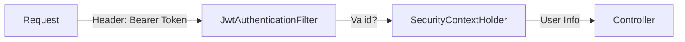

Nếu bạn đang xây dựng một hệ thống phân tán (Microservices) hoặc đơn giản là tách biệt hoàn toàn Frontend (React/Angular/Vue) và Backend (Spring Boot), **Session-based Authentication** truyền thống sẽ sớm bộc lộ nhiều điểm yếu chí mạng. 

Trong bài viết này, chúng ta sẽ không chỉ dừng lại ở lý thuyết mà sẽ đi sâu vào thực chiến: Tại sao lại cần **JWT (JSON Web Token)**, nó hoạt động như thế nào bên trong **Spring Security**, và làm sao để triển khai nó một cách "chuẩn chỉ" nhất.

## 1. Cuộc chiến giữa Session và Token (Stateless vs Stateful)

Trước khi code, chúng ta cần hiểu rõ "tại sao" (The Why).

### Session-based (Stateful)
*   **Cơ chế**: Khi user đăng nhập, Server tạo một `sessionId`, lưu nó vào bộ nhớ (RAM/Cache) và trả về cho Client qua Cookie. Các request sau, Client gửi Cookie này lên để Server đối chiếu.
*   **Vấn đề**:
    1.  **Khó mở rộng (Scalability)**: Nếu bạn chạy 10 Server (Load Balancing), user đăng nhập ở Server A nhưng request tiếp theo lại rơi vào Server B -> Server B không biết user này là ai. Giải pháp là dùng Sticky Session hoặc Centralized Cache (Redis), nhưng lại tăng độ phức tạp và chi phí.
    2.  **Tốn tài nguyên**: Server phải "nhớ" trạng thái của hàng triệu user đang online.
    3.  **Mobile App**: Cookie hoạt động tốt trên Browser, nhưng trên Native Mobile App (iOS/Android) thì xử lý Cookie phức tạp hơn nhiều so với Token.

### Token-based (Stateless - JWT)
*   **Cơ chế**: Server **KHÔNG LƯU GÌ CẢ**. Sau khi login thành công, Server tạo ra một tấm vé (Token) có chứa đầy đủ thông tin (User ID, Role, Hạn dùng...), ký tên đóng dấu (Digital Signature) và đưa cho Client giữ.
*   **Ưu điểm**:
    1.  **Stateless hoàn toàn**: Server không cần nhớ user là ai. Chỉ cần verify chữ ký của Token là xong.
    2.  **Dễ dàng mở rộng**: User cầm Token chạy sang Server nào cũng được, miễn là Server đó có chung "bí mật" (Secret Key) để verify chữ ký.
    3.  **Cross-platform**: Token chỉ là chuỗi String, gửi qua HTTP Header, dễ dàng sử dụng trên Web, Mobile, IoT, hay giữa các Server với nhau.

## 2. Giải phẫu một JWT (JSON Web Token)

Một chuỗi JWT trông như mớ ký tự lộn xộn `xxxxx.yyyyy.zzzzz`, nhưng thực chất nó gồm 3 phần tách biệt bởi dấu chấm `.`:

### 2.1. Header
Chứa metadata về loại token và thuật toán mã hóa.
```json
{
  "alg": "HS512",
  "typ": "JWT"
}
```

### 2.2. Payload (Claims)
Đây là phần "thịt" của token, chứa thông tin dữ liệu (Claims).
```json
{
  "sub": "trahoangdev",         // Subject (thường là username hoặc userId)
  "iat": 1516239022,            // Issued At (Thời điểm tạo)
  "exp": 1516242622,            // Expiration (Thời gian hết hạn)
  "roles": ["ROLE_ADMIN", "ROLE_USER"] // Custom claims
}
```
> **Lưu ý quan trọng**: Payload chỉ được Base64Encode, **KHÔNG ĐƯỢC MÃ HÓA**. Bất kỳ ai cũng có thể decode để đọc thông tin này (vào [jwt.io](https://jwt.io) là đọc được ngay). Vì vậy, **TUYỆT ĐỐI KHÔNG** lưu thông tin nhạy cảm như Password hay số thẻ tín dụng vào Payload.

### 2.3. Signature
Đây là phần quan trọng nhất để chống giả mạo. Server dùng Secret Key (chỉ Server biết) để băm (Hash) Header và Payload.
```
HMACSHA512(
  base64UrlEncode(header) + "." +
  base64UrlEncode(payload),
  secret-key-cua-server
)
```
Nếu Hacker sửa Payload (ví dụ sửa Role từ USER thành ADMIN), chữ ký tạo ra sẽ khác với chữ ký gốc -> Server phát hiện và từ chối ngay.

## 3. Kiến trúc Spring Security Filter Chain trong thực tế

Spring Security hoạt động dựa trên mô hình **Chain of Responsibility**. Request đi vào sẽ phải đi qua một loạt các "cửa ải" (Filter).

Để triển khai JWT, chúng ta sẽ chèn một Custom Filter vào trước `UsernamePasswordAuthenticationFilter`.



### Triển khai `JwtAuthenticationFilter`

Đây là trái tim của hệ thống Authentication.

```java
@Component
@RequiredArgsConstructor
public class JwtAuthenticationFilter extends OncePerRequestFilter {

    private final JwtService jwtService;
    private final UserDetailsService userDetailsService;

    @Override
    protected void doFilterInternal(
            @NonNull HttpServletRequest request,
            @NonNull HttpServletResponse response,
            @NonNull FilterChain filterChain
    ) throws ServletException, IOException {
        
        final String authHeader = request.getHeader("Authorization");
        final String jwt;
        final String userEmail;

        // 1. Kiểm tra header có hợp lệ không
        if (authHeader == null || !authHeader.startsWith("Bearer ")) {
            filterChain.doFilter(request, response);
            return;
        }

        jwt = authHeader.substring(7); // Bỏ chữ "Bearer "
        userEmail = jwtService.extractUsername(jwt); // Lấy username từ token

        // 2. Nếu có username và chưa được authenticate trong Context hiện tại
        if (userEmail != null && SecurityContextHolder.getContext().getAuthentication() == null) {
            
            // 3. Load user từ DB
            UserDetails userDetails = this.userDetailsService.loadUserByUsername(userEmail);

            // 4. Validate token: Chữ ký đúng? Còn hạn không? Đúng user không?
            if (jwtService.isTokenValid(jwt, userDetails)) {
                
                // 5. Tạo Authentication Token của Spring Security
                UsernamePasswordAuthenticationToken authToken = new UsernamePasswordAuthenticationToken(
                        userDetails,
                        null,
                        userDetails.getAuthorities()
                );
                
                authToken.setDetails(new WebAuthenticationDetailsSource().buildDetails(request));
                
                // 6. Lưu vào Context -> Đăng nhập thành công!
                SecurityContextHolder.getContext().setAuthentication(authToken);
            }
        }
        
        // 7. Cho phép đi tiếp đến các filter sau
        filterChain.doFilter(request, response);
    }
}
```

### Cấu hình `SecurityFilterChain`

Tích hợp Filter vừa viết vào luồng chính của Spring Security.

```java
@Configuration
@EnableWebSecurity
@RequiredArgsConstructor
public class SecurityConfiguration {

    private final JwtAuthenticationFilter jwtAuthFilter;
    private final AuthenticationProvider authenticationProvider;

    @Bean
    public SecurityFilterChain securityFilterChain(HttpSecurity http) throws Exception {
        http
            .csrf(csrf -> csrf.disable()) // Stateless không cần CSRF protection
            .authorizeHttpRequests(auth -> auth
                .requestMatchers("/api/v1/auth/**").permitAll() // Cho phép login/register không cần token
                .requestMatchers("/api/v1/admin/**").hasRole("ADMIN") // Phân quyền
                .anyRequest().authenticated() // Còn lại phải đăng nhập
            )
            .sessionManagement(session -> session
                .sessionCreationPolicy(SessionCreationPolicy.STATELESS) // Quan trọng: Không dùng Session!
            )
            .authenticationProvider(authenticationProvider)
            .addFilterBefore(jwtAuthFilter, UsernamePasswordAuthenticationFilter.class); // Chèn Filter của mình vào trước

        return http.build();
    }
}
```

## 4. Chiến thuật Access Token & Refresh Token

Một câu hỏi kinh điển: **User login xong, Token nên sống bao lâu?**

*   Nếu **vĩnh viễn**: Hacker trộm được token -> User mất tài khoản vĩnh viễn (cho đến khi đổi password để invalid token). Rất nguy hiểm.
*   Nếu **ngắn (5 phút)**: An toàn, nhưng User đang lướt web cứ 5 phút bị đá ra bắt login lại -> Trải nghiệm cực tệ (Poor UX).

**Giải pháp: Refresh Token Rotation**

1.  **Access Token (AT)**:
    *   Thời hạn: Ngắn (15-30 phút).
    *   Dùng để: Gọi API lấy dữ liệu.
    *   Lưu trữ: In-memory (biến JS) hoặc LocalStorage (chấp nhận rủi ro).
2.  **Refresh Token (RT)**:
    *   Thời hạn: Dài (7-30 ngày).
    *   Dùng để: **Duy nhất một việc là xin cấp lại Access Token mới** khi AT hết hạn.
    *   Lưu trữ: **HttpOnly Cookie** (An toàn nhất, JS không đọc được để tránh XSS) hoặc Secure Storage (Mobile).

**Luồng hoạt động (Silent Refresh):**

1.  Client gọi API với AT.
2.  Server trả về `401 Unauthorized` (do AT hết hạn).
3.  Client chặn lỗi này (dùng Axios Interceptor), tự động gọi API `/refresh-token` gửi kèm RT.
4.  Server verify RT. Nếu oke -> Trả về AT mới.
5.  Client dùng AT mới gọi lại API ban đầu.
6.  **User hoàn toàn không biết gì xảy ra**, trải nghiệm mượt mà không bị gián đoạn.

## 5. Security Best Practices

Khi làm việc với JWT, đừng quên những nguyên tắc sống còn này:

*   **HTTPS là bắt buộc**: Token bay qua lại giữa Client-Server. Nếu dùng HTTP thường, Hacker bắt gói tin (Sniffing) là lấy được Token ngay.
*   **Không lưu Sensitive Data**: Nhắc lại, payload chỉ được Base64, ai cũng đọc được. Đừng lưu password vào đó.
*   **Blacklist Token (Logout)**: Vì JWT stateless, server không thể "xóa" token. Để làm tính năng Logout thực sự (thu hồi token ngay lập tức), bạn cần lưu danh sách các token đã logout (Blacklist) vào Redis và kiểm tra ở mỗi request.
*   **Mạnh tay với Secret Key**: Key dùng để ký token phải đủ dài và phức tạp. Đừng dùng "123456" hay "mySecretKey". Hãy dùng một chuỗi random 256-bit trở lên.

## Tổng kết

JWT kết hợp với Spring Security là một bộ đôi mạnh mẽ, linh hoạt và chuẩn mực cho các hệ thống hiện đại. Tuy nhiên, "Power comes with Responsibility". Việc hiểu sai và triển khai lỏng lẻo (lộ Secret Key, lưu token sai chỗ, thời hạn quá dài) sẽ tạo ra những lỗ hổng bảo mật nghiêm trọng.

Hy vọng bài viết này giúp bạn có cái nhìn sâu sắc hơn và tự tin triển khai Authentication cho dự án của mình. Happy Coding! 🚀
